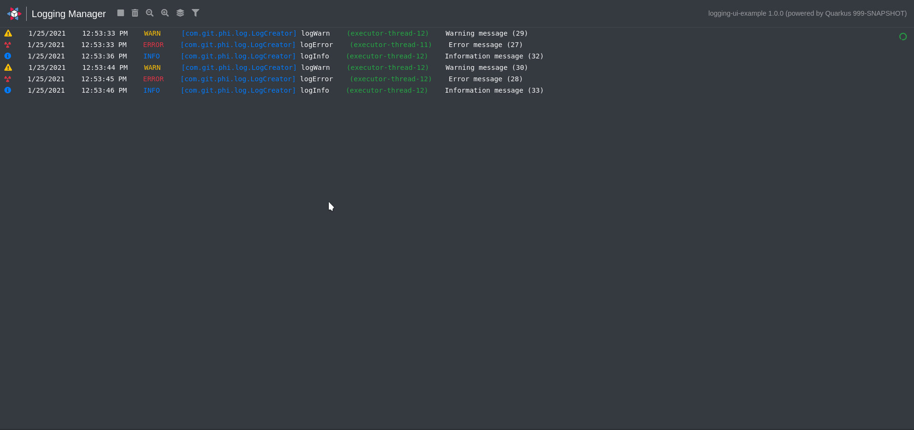

# Logging Manager Extension 
[](https://mvnrepository.com/artifact/io.quarkiverse.loggingmanager/quarkus-logging-manager)
[](#contributors-)

The **Quarkus Logging Manager** Extension provides you endpoints to visualize and manage the
log level of your loggers.

| Endpoint        | Http Method           | Description  |
| ------------- |:-------------:|:-----:|
| `/loggers`      | `GET` | Returns the list of all loggers, with information about the configured and effective level |
| `/loggers?loggerName={loggerName}`     | `GET`      |   Returns the logger specified by this name, with information about the configured and effective level |
| `/loggers` | `POST`      |    Changes the log level of the specified logger |
| `/loggers/levels` | `GET`      |    Get all the available level |

## Security
Security of endpoints is important and we do not want to allow unknown people to know (or worse, change!) the log levels of
our applications.
Fortunately we can secure our endpoints using Quarkus' default security mechanism, as described in [here][1].
All you have to do is define your application.properties similar to this: 

```properties
quarkus.http.auth.basic=true # If you want basic auth. Multiple auth mechanism are supported

quarkus.http.auth.policy.admin-access.roles-allowed=admin
quarkus.http.auth.permission.roles1.paths=/loggers
quarkus.http.auth.permission.roles1.policy=admin-access
```
And, in case you chose Basic Auth, provide a IdentityProvider (either by implementing one or adding an extension that provides
one).
Quarkus will take care of matching the paths (in this case `/loggers` to the policy you defined and granting or denying access).
Then you can also secure all the endpoints in your application using this configuration.


## Example:

To use this in your application, simply add this in your pom.xml:

```xml
    <dependency>
        <groupId>io.quarkiverse.loggingmanager</groupId>
        <artifactId>quarkus-logging-manager</artifactId>
        <version>${logger-manager.version}</version>
        <scope>runtime</scope>
    </dependency>
```

Note: Replace `${logger-manager.version}` with the latest version

Then browse to [http://localhost:8080/q/logging-manager/](http://localhost:8080/q/logging-manager/)



## OpenAPI

You can include the Logger Manager API in the OpenAPI document (and thus also Swagger UI). This needs to be
enabled via config:

```
quarkus.logging-manager.openapi.included=true
```

This will then add the following to your OpenAPI:


## Roadmap
- [x] Add online log viewer option
- [x] Graphical UI to read logger level
- [x] OpenApiSpec for the endpoints
- [x] Make endpoint configurable
- [x] Enable customizable security on the endpoint (see readme file)

## Contributors ✨

Thanks goes to these wonderful people ([emoji key](https://allcontributors.org/docs/en/emoji-key)):

<!-- ALL-CONTRIBUTORS-LIST:START - Do not remove or modify this section -->
<!-- prettier-ignore-start -->
<!-- markdownlint-disable -->
<table>
  <tr>
    <td align="center"><a href="https://github.com/oscarfh"><br /><sub><b>oscarfh</b></sub></a><br /><a href="https://github.com/quarkiverse/quarkiverse-logging-manager/commits?author=oscarfh" title="Code">💻</a> <a href="#maintenance-oscarfh" title="Maintenance">🚧</a></td>
    <td align="center"><a href="http://www.phillip-kruger.com"><br /><sub><b>Phillip Krüger</b></sub></a><br /><a href="https://github.com/quarkiverse/quarkiverse-logging-manager/commits?author=phillip-kruger" title="Code">💻</a> <a href="#maintenance-phillip-kruger" title="Maintenance">🚧</a></td>
  </tr>
</table>

<!-- markdownlint-restore -->
<!-- prettier-ignore-end -->

<!-- ALL-CONTRIBUTORS-LIST:END -->

This project follows the [all-contributors](https://github.com/all-contributors/all-contributors) specification. Contributions of any kind welcome!

[1]: https://quarkus.io/guides/security-authorization
